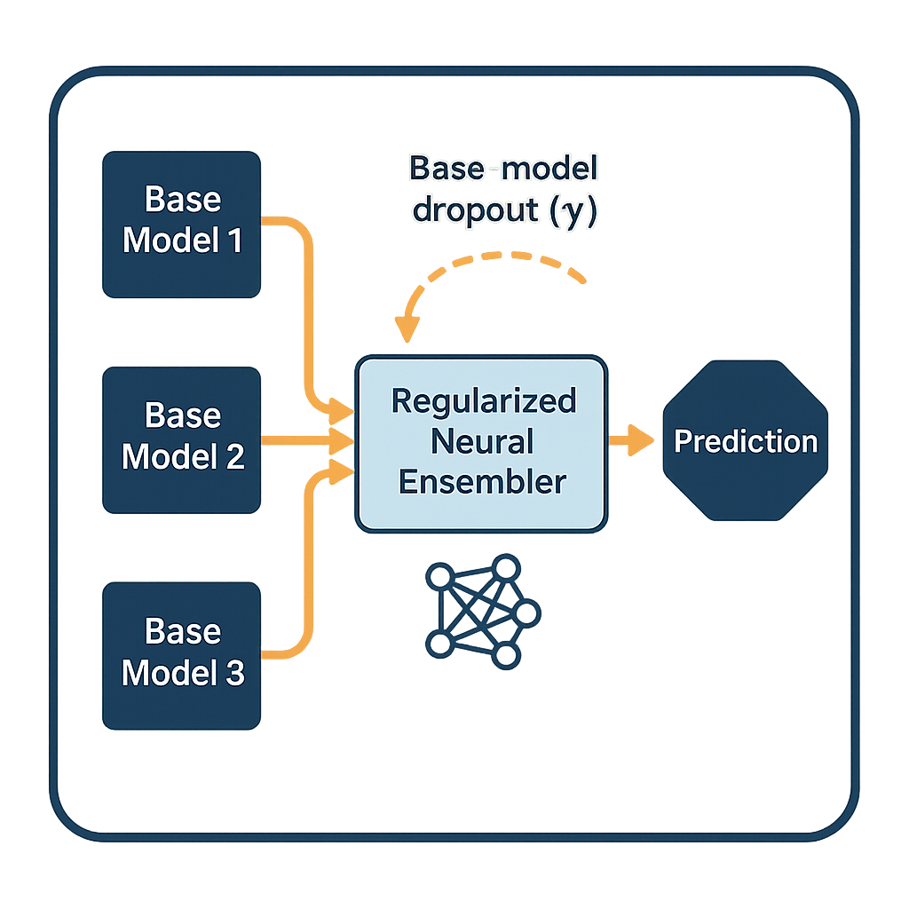

# Regularized Neural Ensemblers

This repo is based on this [paper](https://arxiv.org/abs/2410.04520), which creates neural networks for aggregating predictions of base models, i.e. neural networks as ensembling functions.

<p align="center" width="50%">
     
</p>

# Quick Start

Install locally:


```bash
conda create -n regularized_neural_ensemblers python=3.10
conda activate regularized_neural_ensemblers
git clone https://github.com/machinelearningnuremberg/RegularizedNeuralEnsemblers.git
cd neural_ensemblers
pip install -e .
```

# Inference example
Below we demonstrate how to use the ensembler for inference, assuming that the ensembler has been trained.

```python
import numpy as np
import torch
from neural_ensemblers.model import NeuralEnsembler

# Input shape = [num_samples, num_classes, num_base_functions]
input = torch.rand((5, 3, 2))
print(input)
num_samples,  num_classes, num_base_functions= input.shape
model = NeuralEnsembler(num_base_functions=num_base_functions,
                        num_classes=num_classes)

x, w= model(input)

print(x.shape)
print(w.shape)  # Check the output values

print("x", x)
print("w", w)
```
# Advanced examples

You can follow the examples in the folder `examples/`. Below we show how to train the ensembler on a classification task, by using the base functions in the example `examples/example_sk_classification`. 

```python
from regularized_neural_ensemblers.model import NeuralEnsembler
from regularized_neural_ensemblers.trainer import Trainer
from regularized_neural_ensemblers.trainer_args import TrainerArgs

#shapes:
# base_functions_val = base_functions_test = [num_samples, num_classes, num_base_functions]
# y_val = y_test = [num_samples, num_classes]
base_functions_val, base_functions_test, y_val, y_test = get_base_functions()
device = torch.device("cuda" if torch.cuda.is_available() else "cpu")

#uncover the base functions shape
num_samples,  num_classes, num_base_functions= base_functions_val.shape

#define model
model = NeuralEnsembler(num_base_functions=num_base_functions,
                        num_classes=num_classes,
                        hidden_dim=32,
                        num_layers=3,
                        dropout_rate=0.2,
                        task_type="classification", 
                        mode="stacking").to(device)

#define model trainer and trainer args
trainer_args = TrainerArgs(batch_size=512, lr=0.001, epochs=1000, device=device)
trainer = Trainer(model=model, trainer_args=trainer_args)

#fit the model using the trainer using the predictions of base models on validation set
trainer.fit(base_functions_val, y_val)

#make predictions with the neural ensembler
y_pred_test = model.predict(base_functions_test)

acc = accuracy_score(y_test, y_pred_test.argmax(axis=1))
print("accuracy", acc)
```